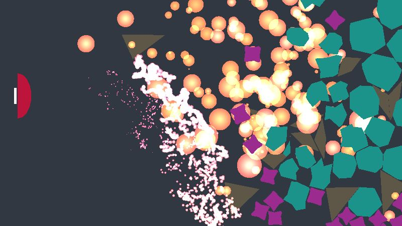

# Year of Unity - February: Debrong

My second monthly game of 2022, a pong-like game: *Debrong* (aka debris pong). Pong is a pretty well known game, so I don't think I need to explain the basic idea.
Unlike the original Pong game, my version has no AI component. I started off with one, but couldn't think of any way to make it interesting to play against, so I scrapped it for obstacles. Although I'm largely frsutrated/disappointed by all the things I didn't manage to get into the game in time, I'm actually pretty pleased with the use of obstacles in place of a direct opponent.

## Goals
As with my previous game, the main focus here gaining a better understanding of Unity and C#. In addition, there were some other topics I wanted to focus on:

#### Using Unity's physics system
Something I had completely avoided on my previous game was the built-in physics system, but I had no idea how to use it properly, so this pong game was an excuse to dive in. That being said, I only feel like I've scratched the surface here, I only used simple colliders (circle and polygon2D) and didn't end up using anything like springs, hinges or point effectors (though I did play with them a bit). More stuff to look into in the future I guess.

#### Particle effects
This was a fun one! I've seen loads of neat videos using the built-in particle system and had played with it briefly on my previous game, for making explosions. I somehow came across [this video](https://www.youtube.com/watch?v=agr-QEsYwD0), which I shamelessly copied for the main ball-trail effect in this game. From there I spent way too much time tweaking setting to try to make things look cooler or more extreme. Lesson learned... particle effects are a huge time sink! Still, I want to eventually get into doing effects with the visual effects graph, which seems too cool to pass up. [This YouTube channel](https://www.youtube.com/c/GabrielAguiarProd) has loads of interesting content on the topic.

#### Procedural object generation
Again, I was wooed by the call of the YouTube video and figured I needed to play around with procedural generation myself. In this case, I only aimed to do 2D 'shape' generation (which actually includes mesh generation, due to the way the rendering is working). There are really only 3 shapes that get generated in the game. One is the player paddle, which randomly generates one of three shapes: a simple rectangle, an boxy angled shape or a curved shape. In addition to the player shape, there are also 'explosives' (which use boxy shapes with beveled corners and bent edges) as well as radial shapes (which generally have a bumpy circular shape, though triangles are also included). Except for the hard-coded simple shapes, the rest of the shapes follow the same idea of picking an origin points and selecting points at some distance while rotating through 360 degrees. This ended up being pretty simplistic and nowhere near as flashy as the videos that inspired me to try procedural generation, but at least it's a start.

#### Destructible objects
Bridging both the physics & particle systems, I wanted to have shapes that could be blown up into smaller pieces, while still being part of 'the game' and responding to the physics system. This was accomplished by simply breaking up the triangles that made up each shape's mesh into individual meshes with their own colliders/physics. Originally I wanted to break meshes up into more interesting sub-shapes from the originals (not just triangles), but I was taking too long trying to figure out a general solution, and fell back to the triangle thing. In the future, I'd really like to look into Delaunay triangulation (and/or Voronoi stuff) to better understand how to implement 'generic' destructible shapes.

## Future work
Oh man, I missed so many marks on this one...
- Add sound! I can't believe I ran out of time to do anything with sound
- Add camera shake on explosions
- Swap out all particle systems for VFX Graph implementations
- Improve particle effects aesthetically (especially goal scoring effects)
- Add particle effects on all ball-to-obstacle impacts (just a little dust effect even)
- Improve level editing tools, to make it easier to 'author' interesting content
- Explore use of additive scene loading, to avoid re-loading all objects for every level